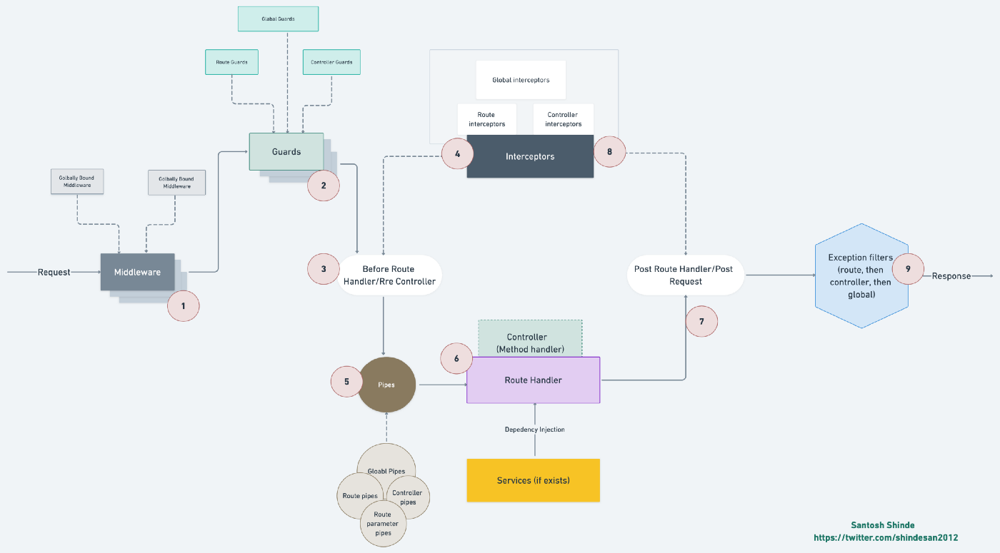

## Nestjs Request Lifecycle

  

1. Request: Client Membuat Request

2. Nest Middleware: Apapun class yang mengimplementasi NestMiddleware interface dan  sudah ter-register akan memproses request   
	- Middleware ini, seperti Express Middleware, Dapat  meng estrak request/response object atau set nilai contextual    
	- Nest js juga support Express middleware library.
	-Layer ini Diana kamu biasanya meng-handle sesuatu hal, seperti membaca JWT token dari header dan setting user data dari sebuah request.

3. Guards: Setelah middleware, tiap class yang mengimplementasi CanActive interface di panggil.
	- Ini adalah Guard Interface, dan mereka menentukan apakah request ini akan di accepted/rejected.
	- Dengan contoh JWT Auth, ini adalah titik dimana kamu akan membaca dari set User data dari sebelumnya yaitu middleware yang memasukannya ke ExecutionContext dan mengecheck apakah itu cocok dengan apa yang seharusnya untuk meng akses end point tertentu.
	- Jika tidak, kamu dapat me reject request.

4. NestInterceptors: Selanjutnya, apapun class yang mengimplementasi NestInterceptor Interface.
	- NestInterceptors mempunyai callbacks yang dapat berjalan di kedua before dan after handler response.
	- Biasanya, Interceptors bagus di tempatkan seperti hal loggers/metrics yang dibutuhkan di keduanya before + after context dari sebuah request, atau kamu butuh mengubah bentuk input/output.

5. PipeTransform: Langkah terakhir Sebelum actual request handler yang di panggil adalah class yang mengimplementasi PipeTransform.
	- Seperti namanya, ini adalah transforms pada arguments didalam request.
	- Builtin Pipes adalah ValidationPipe, ParseIntPipe, etc.
	- Ini umumnya digunakan untuk menentukan sebuah format/ mem-validasi arguments yang akan selanjutnya untuk di berikan ke controller route handler.

7. Controller: Terakhir, @Controller di panggil maka
	- Ini biasanya endpoint API handler.
	- Kemungkinan akan memanggil DB/persistance method atau berkomunikasi dengan service API lain.

8. Response: Response di kirimkan remblai ke client (Jangan lupa itu akan di handle oleh NestInterceptors “after” handlers, di eksekusi jika NestInterceptors “after” handlers Sudah di registrasikan)

LICENSE [ABOUT-NESTJS](LICENSE).